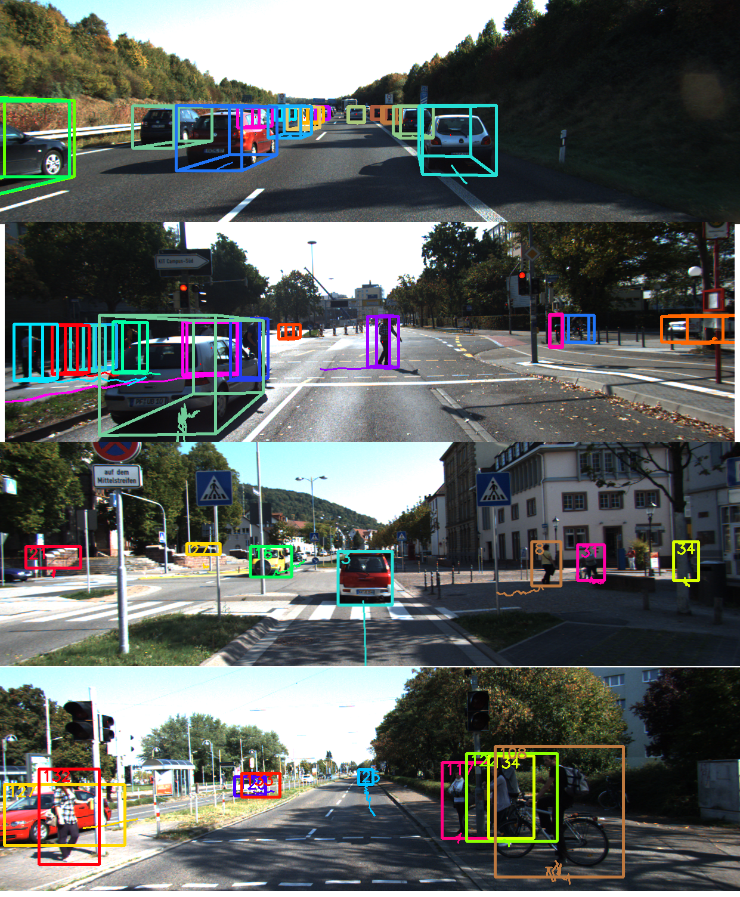

# Multi-object Tracking in The Driving Scene.
The code in this repository builds upon [CIWT implementation](https://github.com/aljosaosep/ciwt/tree/ciwt2). C++ for the tracker. Python for evaluation code.



## Demo  Video
[Click here to watch the video](https://drive.google.com/drive/folders/1oaj9U7-WfujPwx3zxEniiv3CKn-nBtRj?usp=sharing).
 


## Overview
- [Introduction](#introduction)
- [The Work](#The-work)
- [The new tracker Results](#Best-car-pedestrian-balanced-results)
- [Results Tables](#Tables)
- [Acknowledgement](#acknowledgment)
- [Prerequisite](#Prerequisite)
- [Install](#install)
- [Running or Evaluating the Tracker](#Running-or-Evaluating-the-Tracker)
- [Remarks](#remarks)
- [Possible issues](#possible-issues)
## Introduction
This work builds upon work done by (Osep, 2017). The original code can be found [here](https://github.com/aljosaosep/ciwt/tree/ciwt2). The idea is to adapt the tracker to work with modern detectors, and apply different modification on the tracker and evaluate it.
The detector used  was [PointRcnn(Shi,2019)](https://github.com/sshaoshuai/PointRCNN), the same detector used in the baseline [AB3DOT(Weng,2020)](https://github.com/xinshuoweng/AB3DMOT), making the comparison fairer. All the experiments were done on [KITTI MOT dataset(Geiger,2012)](http://www.cvlibs.net/datasets/kitti/eval_tracking.php). Videos for qualitative results can be found [here](https://drive.google.com/drive/folders/1oaj9U7-WfujPwx3zxEniiv3CKn-nBtRj?usp=sharing).


### Running the Tracker
I added the scripts need to reformat detections for PointRcnn.txt files so they would compact with CIWT tracker. The scripts can be found ./scripts folder. The processed detections can be found in ./data folder. 
### Modifying the Motion Model and Visualization Functions
In 2016 the detectors did not provide a reliable estimation of the detections' orientation.
PointRcnn in gives a very good estimation, therefore tracker's motion model was modified in order to model the orientation of hypothesises. To make sure the tracks have reasonable orientations at consecutive time steps, the angles are adjusted in the same manner as in the baseline in cases where the difference in angle for hypothesis between consecutive frames is big i.e. is no sudden big change in the orientation. Of course, one can skip modelling the orientation, and directly take what PointRcnn or any modern detector gives to tracks.  In order to model orientation during tracking `--is_oriented` option has to be set to true(default) or false otherwise. In the [tables](#table) the character 'o' refers to whether orientation is modeled (o1) or not (o0). More explanation on the notation can be found tables section. For cars, we can notice that with the default motion parameters(s0) have better MOTA in 2D in contrast to results in 3D with modified motion parameters(s1), where modelling orientation has a positive impact on MOTA. In order to validate that motion model is working, I updated 3D visualization functions to orient 3D boxes, which were previously oriented according to the ego-motion. I aslo fixed an issue of boxes appearing as lines, the problem was related to boxes mostly outside the image.

### Experimenting with two Track Termination Methods
The proposed method is to terminate a hypothesis once their 2D project does not appear in the image space to solve the issue with possible ghost tracks. The tracker offered a default track-termination method of checking if the object is out of camera frustum bounds. 
The experiments showed that the default method is marginally better with about 1% in terms of MOTA. Terminating the track once only two, or three points are still in the image worsened MOTA.
To alter to the proposed termination method --`check_exit_to2D_projeciton` has to be set to true. In the [tables](#tables) this method is referred to as 'p' where 'p1' indicates that the proposed termination method is used.

### Experimenting with Data Associations Algorithms
The baseline(AB3DMOT) uses 3D IoU(Intersection over Union) as a sole measure for data association, and the then it does a bi-partite matching solved by Hungarian algorithm. CIWT by default follows different methodology,
it performs MAP inference in a CRF (Conditional Random Field), with QPBO solver, to select associated detections and tracks or new tracks(these are called a hypothesis). Hypotheses score depends on data association measures, which is weighted(between 0 and 1) score of appearance model (intersection kernels over colour)(Choi,2015) and 2D IoU. Exchanging the default association algorithm with 3D IoU as sole measure worsened MOTA. Looking at the tables, where models include 'u1' indicates the usage of 3D IoU as sole association measure, and 'u0' being the default measure.

By that time the only positive trial and modification was modelling the orientation, CIWT already beat the baseline in 2D for cars. However, for 3D it was still lacking behind by 2% in terms of MOTA.
Though I was not officially asked to try the default measure with a mix of 3D and 2D IoU instead of 2D only. Trying that out, It was the first time where CIWT beats the baseline for cars in terms of MOTA in 3D. This was a marginal win with almost 0.5% difference. The results for pedestrians were still behind for both 2D and 3D in terms of MOTA. To apply this modification on the default association measure `--association_score_is_3DIoU` has to be set to true.  This modification introduced a new hyperparameter that takes values between 0 and 1 to weight 3D and 2D IoU. Thus the overal IoU score will remain normalized between 0 and 1. Setting IoU3D_model_weight to zero, should retrieve back the default measure for association; setting association_appearance_model_weight to zero and assoc_weight_distance_from_camera to a big number should give approximately 3DIoU as the sole measure for association. 
 

### Studying the effect of 2D-3D state coupling for Motion Model
More details on 2D-3D state coupling can be found in (Osep, 2017)The original code was modified to toggle 2D-3D state coupling with `--enable_coupling` set to true, the coupling is enabled. Overall, coupling had a positive impact on MOTA both in 2D and 3D except for 'u1','o0','ex0',and 'p1' models.

### Studying the effect of excluding Extrapolated Hypothesises
Excluding extrapolated hypothesises that does not have a corresponding detection(inlier), resulted in worsening MOTA, where also recall decreased a bit, but precision increased a bit, and that makes sense.
I also tried to exclude hypothesises that are marked as terminated from the QPBO for the hypothesis selection (hypothesises selected to be reported). This also decreased MOTA after evaluating the tracker. To run the tracker and without reporting extrapolated hypothesises `--report_extrapolated` should be set to false. To run QPBO without the terminated tracks is not possible in the currrent version of the application. ( This was not a task assgined by the advisor)
 Reverting  to the commit "fixed misconceptions" #b143e765 should provide the required code for that experiment. 
### Hyperparamters Searching
Three types of search algorithms were used for finding hyperparamters to optimize the tracker.
### Random Search
Where hyperparameters are initialized according to the default settings(can also be changed manually), and for each iteration, a float number is a sample from a uniform distribution, where each hyperparameter is assigned its own distribution with its own variance. This sample is added to the hyperparameter. The hyperparameter is then checked if it is valid and corrected if not.
### Random-directed Search
I had trouble finding a name that fits the algorithm. The algorithm is similar the previous one, Random Search. However, only the direction of the step is sampled, and if a random step makes progress, the step will be repeated in the same direction but with a less magnitutde in hyperparameter space until the MOTA decreases. If the random step decreases MOTA, then the steps are toggled, i.e. the signs of the sampled changes for the hyperparameter are switched. Positive to negative or vice-versa. Every step in the hyperparameter space is done for one group of hyperparameters(  in this case, association options and tracking options). The selected group is changed once there was a successful step that was followed by an unsuccessful one(MOTA decreased).
### Grid/Greedy search
It steps in one dimension(hyperparameter), if it is successful(MOTA increases), it keeps stepping the same direction until an unsuccessful step then switches to another dimension. If the first step was unsuccessful, the other direction is tried, then it switches to another dimension until the first unsuccessful step.

### Remarks
All the algorithms were tried. Random search rarely gave (from about 2 thousand trial) good results, and it was only able to beat the baseline for cars. Then I later tried Random-Directed search, where MOTA is averaged from cars and pedestrians. This method showed to be more efficient and successful. It was able to beat the baseline on training sequences. Then the hyperparameters were manually adjusted and refined with grid search for the final results. 

The training sequences from KITTI were divided to sequences for hyperparameter search, call in this project training sequences, the rest of sequences were called valdiation sequences.

You may also notice that the results sometimes are better in validation sequences for cars and worse for pedestrians. This can be due to the validation sequences being larger, and less challenging for tracking cars and more challenging for tracking pedestrians.

## Best car-pedestrian-balanced results
This model I found to have the best balance between MOTA results for cars and pedestrians in 2D and 3D. This version of CIWT models orientation, uses 2D-3D state coupling, data association score is [(appearence+motion+(2DIoU + 3D IoU))](#Experimenting-with-Data-Associations-Algorithms). 
Results of CIWT with other detectors can be found in ./results 
under name results_with_other_detectors_. Other results that did good for either car or pedesitrians can be found in ./results/other_good_results.
### Training Sequences 2D:
### Cars
|Model  |sMOTA   |MOTA    |MOTP    |MT      |ML   |IDS|FRAG|F1     |Prec   |Recall |FAR    |TP  |FP |FN  |sAMOTA |AMOTA  |AMOTP  |
|-------|--------|--------|--------|--------|-----|---|----|-------|-------|-------|-------|----|---|----|-------|-------|-------|
|NewTracker   |0.776659|0.776659|0.847820|0.746667|0.053|2  |25  |0.89959|0.92792|0.87295|0.19658|7544|586|1098|0.89418|0.43462|0.79895|
|AB3DMOT|0.772155|0.772155|0.870175|0.766667|0.06 |0  |19  |0.89704|0.93581|0.86136|0.17243|7493|514|1206|0.85822|0.39108|0.80000|

### Pedestrians
|Model  |sMOTA   |MOTA    |MOTP    |MT      |ML   |IDS|FRAG|F1     |Prec   |Recall |FAR    |TP  |FP |FN  |sAMOTA |AMOTA  |AMOTP  |
|-------|--------|--------|--------|--------|-----|---|----|-------|-------|-------|-------|----|---|----|-------|-------|-------|
|NewTracker   |0.52599 |0.52599 |0.66210 |0.25    |0.47059|28 |118 |0.71445|0.92697|0.58120|0.05032|1904|150|1372|0.59114|0.20232|0.45452|
|AB3DMOT|0.49878 |0.49878 |0.66737 |0.26471 |0.42647|26 |120 |0.70113|0.90224|0.57333|0.06877|1892|205|1408|0.57857|0.19359|0.45192|


### Training Sequences 3D:
### Cars
|Model  |sMOTA   |MOTA    |MOTP    |MT      |ML   |IDS|FRAG|F1     |Prec   |Recall |FAR    |TP  |FP |FN  |sAMOTA |AMOTA  |AMOTP  |
|-------|--------|--------|--------|--------|-----|---|----|-------|-------|-------|-------|----|---|----|-------|-------|-------|
|NewTracker   |0.77613 |0.77613 |0.65059 |0.75333 |0.053|3  |23  |0.89922|0.92776|0.87238|0.19658|7526|586|1101|0.89398|0.43389|0.61473|
|AB3DMOT|0.77480 |0.77480 |0.78820 |0.76667 |0.06 |0  |13  |0.89835|0.93689|0.86285|0.16974|7512|506|1194|0.85948|0.39209|0.72552|
### Pedestrians
|Model  |sMOTA   |MOTA    |MOTP    |MT      |ML   |IDS|FRAG|F1     |Prec   |Recall |FAR    |TP  |FP |FN  |sAMOTA |AMOTA  |AMOTP  |
|-------|--------|--------|--------|--------|-----|---|----|-------|-------|-------|-------|----|---|----|-------|-------|-------|
|NewTracker   |0.61560 |0.61560 |0.61167 |0.47059 |0.33824|3  |23  |0.77462|0.94105|0.65822|0.04529|2155|135|1119|0.65623|0.24489|0.45185|
|AB3DMOT|0.59266 |0.59266 |0.66944 |0.44118 |0.25000|1  |14  |0.77182|0.89219|0.68006|0.09124|2251|272|1059|0.66874|0.24856|0.49634|

### Validation Sequences 2D
### Cars
|Model  |sMOTA   |MOTA    |MOTP    |MT      |ML   |IDS|FRAG|F1     |Prec   |Recall |FAR    |TP  |FP |FN  |sAMOTA |AMOTA  |AMOTP  |
|-------|--------|--------|--------|--------|-----|---|----|-------|-------|-------|-------|----|---|----|-------|-------|-------|
|NewTracker|0.79117 |0.79117 |0.85644 |0.71739 |0.16184|3  |85  |0.90446|0.93001|0.88029|0.24428|16317|1228|2219|0.89950|0.43066|0.80377|
|AB3DMOT|0.77435 |0.77435 |0.87057 |0.71014 |0.06039|2  |63  |0.90425|0.92400|0.88532|0.28785|17593|1447|2279|0.88028|0.40966|0.82514|


### Pedestrians
|Model  |sMOTA   |MOTA    |MOTP    |MT      |ML   |IDS|FRAG|F1     |Prec   |Recall |FAR    |TP  |FP |FN  |sAMOTA |AMOTA  |AMOTP  |
|-------|--------|--------|--------|--------|-----|---|----|-------|-------|-------|-------|----|---|----|-------|-------|-------|
|AB3DMOT|0.56193 |0.56193 |0.66958 |0.38384 |0.22222|37 |296 |0.76049|0.86718|0.67717|0.16431|5393|826|2571|0.61770|0.22701|0.49126|
|NewTracker|0.54739 |0.54739 |0.66147 |0.38384 |0.26263|37 |326 |0.75301|0.84430|0.67953|0.19634|5352|987|2524|0.64468|0.23744|0.50204|


### Validation Sequences 3D
### Cars
|Model  |sMOTA   |MOTA    |MOTP    |MT      |ML   |IDS|FRAG|F1     |Prec   |Recall |FAR    |TP  |FP |FN  |sAMOTA |AMOTA  |AMOTP  |
|-------|--------|--------|--------|--------|-----|---|----|-------|-------|-------|-------|----|---|----|-------|-------|-------|
|NewTracker|0.79130 |0.79130 |0.68168 |0.71498 |0.15700|2  |92  |0.90499|0.93138|0.88004|0.24050|16411|1209|2237|0.89872|0.43130|0.65645|
|AB3DMOT|0.78252 |0.78252 |0.78822 |0.71498 |0.06039|0  |35  |0.90789|0.92911|0.88761|0.26875|17707|1351|2242|0.88606|0.41367|0.76037|


### Pedestrians
|Model  |sMOTA   |MOTA    |MOTP    |MT      |ML   |IDS|FRAG|F1     |Prec   |Recall |FAR    |TP  |FP |FN  |sAMOTA |AMOTA  |AMOTP  |
|-------|--------|--------|--------|--------|-----|---|----|-------|-------|-------|-------|----|---|----|-------|-------|-------|
|NewTracker|0.66871 |0.66871 |0.62427 |0.55556 |0.21212|6  |93  |0.82073|0.90041|0.75400|0.13050|5931|656|1935|0.74232|0.30369|0.51326|
|AB3DMOT|0.67547 |0.67547 |0.66480 |0.49495 |0.25253|0  |61  |0.81942|0.94298|0.72449|0.06943|5772|349|2195|0.73231|0.30272|0.55101|

## Tables
AB3DMOT(Weng,2020) is the baseline. All results shown in theses tables are for KITTI.
training sequences = 2, 6, 7, 8, 10, 13, 14, 16, 18
validation sequences = 0,1,3,4,5,9,11,12,15,17,19,20

The rest of models are all CIWT with PointRCNN detector(Shi,2019).
For each modified CIWT model we have charecters that refers to a modification and a number that binary to indicate yes or no:
* o refers to whether orientation is modeled. 
* c refers to whether [2D-3D state coupling is enable](#Studying-the-effect-of-2D-3D-state-coupling-for-Motion-Model).
* p refers to whetherto the [proposed termination method](#Experimenting-with-two-Track-Termination-Methods).
* u refers to [accociation measures](#Experimenting-with-Data-Associations-Algorithms) here 0 would indicate the default CIWT association (appearence+motion+2DIoU), 1 is 3D IoU as sole measure, and 2 is (appearence+motion+(2DIoU + 3D IoU)).
* s refers to whether the new parameters for the motion model.
* ex0 means [the hypothesis that have no inliers are not reported](#Studying-the-effect-of-excluding-Extrapolated-Tracks).
* nth is an abreviation for no terminated hypothesises the experiment mentioned [here](#Studying-the-effect-of-excluding-Extrapolated-Tracks). These nth expirments are o1_p0_u2_s1. 
### Other CIWT modifications on Validation Sequences
### Cars 2D
|Model             |sMOTA |MOTA  |MOTP  |MT    |ML    |IDS|FRAG|F1    |Prec  |Recall|FAR   |TP   |FP  |FN  |sAMOTA|AMOTA |AMOTP |
|------------------|------|------|------|------|------|---|----|------|------|------|------|-----|----|----|------|------|------|
|o1_c0_p0_u2_s1    |0.7956|0.7956|0.8586|0.7657|0.1184|2  |86  |0.9086|0.9203|0.8973|0.2892|16780|1454|1921|0.8951|0.4356|0.8276|
|o1_c1_p0_u2_s1    |0.7935|0.7935|0.8545|0.7415|0.1449|1  |84  |0.9068|0.9229|0.8912|0.2757|16586|1386|2025|0.9026|0.4387|0.8241|
|nth_c0            |0.7939|0.7939|0.8588|0.7609|0.1063|2  |174 |0.9115|0.9293|0.8943|0.2650|17516|1332|2071|0.8922|0.4219|0.8049|
|nth_c1            |0.7794|0.7794|0.8529|0.7246|0.1522|1  |172 |0.9023|0.9231|0.8824|0.2789|16820|1402|2242|0.8813|0.4185|0.8013|
|o1_c0_p0_u2_s1_ex0|0.7904|0.7904|0.8598|0.7705|0.0942|6  |178 |0.9061|0.9221|0.8908|0.2805|16683|1410|2046|0.8869|0.4203|0.8064|
|o1_c1_p0_u2_s1_ex0|0.7862|0.7862|0.8555|0.7415|0.1280|1  |182 |0.9033|0.9230|0.8844|0.2735|16488|1375|2156|0.8901|0.4261|0.8046|
|AB3DMOT           |0.7743|0.7743|0.8706|0.7101|0.0604|2  |63  |0.9042|0.9240|0.8853|0.2878|17593|1447|2279|0.8803|0.4097|0.8251|
|o1_c1_p1_u0_s1    |0.7420|0.7420|0.8530|0.7295|0.1377|6  |92  |0.8866|0.8863|0.8870|0.4247|16641|2135|2121|0.8921|0.4236|0.8227|
|o1_c0_p1_u0_s1    |0.7283|0.7283|0.8587|0.7150|0.1691|4  |81  |0.8826|0.8888|0.8765|0.4197|16861|2110|2375|0.8660|0.3973|0.8062|
|o1_c1_p0_u1_s1    |0.7513|0.7513|0.8522|0.7415|0.1329|3  |112 |0.8905|0.8922|0.8889|0.4014|16695|2018|2087|0.8713|0.4080|0.8020|
|o1_c0_p0_u1_s1    |0.7749|0.7749|0.8597|0.7246|0.1570|4  |85  |0.8970|0.9202|0.8750|0.2793|16181|1404|2311|0.8935|0.4198|0.8055|
|o1_c1_p0_u0_s1    |0.7852|0.7852|0.8540|0.7343|0.1280|6  |94  |0.9033|0.9192|0.8879|0.2892|16541|1454|2088|0.8980|0.4270|0.8026|
|o1_c0_p0_u0_s1    |0.7749|0.7749|0.8597|0.7246|0.1570|4  |85  |0.8970|0.9202|0.8750|0.2793|16181|1404|2311|0.8935|0.4198|0.8055|
|o0_c0_p0_u0_s0    |0.7927|0.7927|0.8650|0.7560|0.1232|7  |79  |0.9076|0.9205|0.8951|0.2884|16784|1450|1967|0.9098|0.4370|0.8346|
|o0_c1_p0_u0_s0    |0.7907|0.7907|0.8560|0.7391|0.1449|8  |83  |0.9053|0.9189|0.8921|0.2894|16490|1455|1995|0.8990|0.4392|0.8278|
|o0_c0_p0_u0_s1    |0.7829|0.7829|0.8700|0.7633|0.1039|5  |97  |0.9033|0.9131|0.8937|0.3165|16722|1591|1990|0.8923|0.4204|0.8159|
|o0_c1_p0_u0_s1    |0.7878|0.7878|0.8694|0.7440|0.1425|6  |88  |0.9036|0.9200|0.8879|0.2839|16406|1427|2072|0.8820|0.4243|0.8152|


### Cars 3D
|Model             |sMOTA |MOTA  |MOTP  |MT    |ML    |IDS|FRAG|F1    |Prec  |Recall|FAR   |TP   |FP  |FN  |sAMOTA|AMOTA |AMOTP |
|------------------|------|------|------|------|------|---|----|------|------|------|------|-----|----|----|------|------|------|
|o1_c1_p0_u2_s1    |0.7875|0.7875|0.6789|0.7536|0.1256|1  |99  |0.9054|0.9169|0.8942|0.3028|16785|1522|1987|0.8863|0.4251|0.6554|
|o1_c0_p0_u2_s1    |0.7845|0.7845|0.6869|0.7126|0.1691|0  |78  |0.9020|0.9295|0.8761|0.2473|16388|1243|2318|0.8781|0.4196|0.6620|
|o1_c0_p0_u2_s1_ex0|0.7827|0.7827|0.6882|0.7077|0.1498|0  |165 |0.9004|0.9315|0.8714|0.2373|16235|1193|2397|0.8840|0.4182|0.6596|
|o1_c1_p0_u2_s1_ex0|0.7809|0.7809|0.6793|0.7343|0.1208|0  |191 |0.9016|0.9207|0.8833|0.2841|16578|1428|2191|0.8888|0.4251|0.6564|
|nth_c0            |0.7798|0.7798|0.6838|0.7488|0.1014|1  |181 |0.9060|0.9213|0.8912|0.2978|17524|1497|2140|0.8910|0.4210|0.6567|
|AB3DMOT           |0.7825|0.7825|0.7882|0.7150|0.0604|0  |35  |0.9079|0.9291|0.8876|0.2687|17707|1351|2242|0.8861|0.4137|0.7604|
|nth_c1            |0.7744|0.7744|0.6744|0.7222|0.1377|0  |182 |0.9008|0.9201|0.8822|0.2920|16914|1468|2259|0.8805|0.4175|0.6506|
|o1_c1_p1_u0_s1    |0.7676|0.7676|0.6699|0.7246|0.1304|6  |118 |0.8999|0.9124|0.8878|0.3290|17238|1654|2179|0.8924|0.4233|0.6477|
|o1_c0_p1_u0_s1    |0.7452|0.7452|0.6778|0.7077|0.1618|2  |105 |0.8922|0.9077|0.8772|0.3523|17409|1771|2436|0.8801|0.4079|0.6558|
|o1_c1_p0_u1_s1    |0.7456|0.7456|0.6782|0.6932|0.1860|2  |116 |0.8856|0.9058|0.8663|0.3364|16257|1691|2510|0.8700|0.4068|0.6553|
|o1_c0_p0_u1_s1    |0.7622|0.7622|0.6854|0.6812|0.1957|4  |119 |0.8919|0.9205|0.8651|0.2781|16195|1398|2526|0.8750|0.4094|0.6591|
|o1_c1_p0_u0_s1    |0.7780|0.7780|0.6801|0.6908|0.1715|6  |113 |0.8985|0.9286|0.8702|0.2479|16204|1246|2416|0.8956|0.4269|0.6541|
|o1_c0_p0_u0_s1    |0.7720|0.7720|0.6547|0.7667|0.1133|3  |35  |0.8932|0.9375|0.8529|0.1607|7186 |479 |1239|0.8657|0.4277|0.5945|
|o0_c0_p0_u0_s0    |0.7597|0.7597|0.6922|0.6546|0.1522|4  |110 |0.8912|0.9175|0.8665|0.2908|16250|1462|2504|0.8651|0.3965|0.6499|
|o0_c1_p0_u0_s0    |0.7579|0.7579|0.6889|0.6449|0.1667|6  |126 |0.8895|0.9137|0.8666|0.3022|16082|1519|2475|0.8707|0.4138|0.6611|
|o0_c0_p0_u0_s1    |0.7688|0.7688|0.6993|0.6981|0.1498|4  |101 |0.8951|0.9157|0.8754|0.2980|16282|1498|2318|0.8861|0.4157|0.6719|
|o0_c1_p0_u0_s1    |0.7713|0.7713|0.6900|0.7222|0.1184|4  |108 |0.8973|0.9091|0.8857|0.3278|16482|1648|2126|0.8772|0.4200|0.6615|

### Pedestrians 2D
|AB3DMOT           |0.5619|0.5619|0.6696|0.3838|0.2222|37 |296|0.7605|0.8672|0.6772|0.1643|5393 |826 |2571|0.6177|0.2270|0.4913|
|------------------|------|------|------|------|------|---|---|------|------|------|------|-----|----|----|------|------|------|
|o1_c1_p0_u2_s1    |0.5339|0.5339|0.6603|0.3737|0.2626|43 |321|0.7468|0.8340|0.6761|0.2109|5326 |1060|2551|0.6203|0.2218|0.4854|
|o1_c0_p0_u2_s1    |0.5228|0.5228|0.6630|0.4040|0.2626|34 |309|0.7423|0.8203|0.6779|0.2327|5340 |1170|2537|0.6130|0.2206|0.4891|
|o1_c0_p0_u1_s1    |0.4974|0.4974|0.6646|0.3030|0.3636|47 |328|0.7184|0.8332|0.6314|0.1977|4966 |994 |2899|0.5624|0.2088|0.4687|
|o1_c1_p0_u1_s1    |0.5041|0.5041|0.6627|0.3131|0.3737|54 |333|0.7206|0.8445|0.6284|0.1810|4942 |910 |2923|0.5809|0.2127|0.4832|
|o1_c1_p1_u0_s1    |0.5112|0.5112|0.6619|0.3232|0.3333|40 |299|0.7241|0.8529|0.6290|0.1707|4975 |858 |2934|0.5984|0.2050|0.4707|
|o1_c0_p1_u0_s1    |0.4743|0.4743|0.6669|0.3737|0.3030|34 |296|0.7182|0.7989|0.6523|0.2608|5207 |1311|2776|0.5186|0.1919|0.4730|
|o1_c0_p0_u0_s1    |0.4840|0.4840|0.6640|0.3434|0.3333|31 |280|0.7113|0.8200|0.6280|0.2158|4944 |1085|2929|0.5782|0.2042|0.4901|
|o1_c1_p0_u0_s1    |0.5341|0.5341|0.6639|0.3333|0.3636|35 |288|0.7330|0.8771|0.6296|0.1385|4966 |696 |2921|0.6334|0.2223|0.4887|
|o0_c0_p0_u0_s0    |0.5616|0.5616|0.6688|0.4040|0.3636|20 |269|0.7499|0.8843|0.6509|0.1333|5122 |670 |2747|0.6085|0.2292|0.4757|
|o0_c1_p0_u0_s0    |0.5494|0.5494|0.6675|0.3636|0.3131|13 |258|0.7459|0.8660|0.6550|0.1589|5164 |799 |2720|0.6082|0.2198|0.4912|
|o0_c0_p0_u0_s1    |0.5584|0.5584|0.6670|0.4040|0.3030|27 |288|0.7499|0.8786|0.6542|0.1416|5151 |712 |2723|0.6161|0.2306|0.4743|
|o0_c1_p0_u0_s1    |0.5348|0.5348|0.6675|0.3434|0.3131|16 |277|0.7391|0.8506|0.6534|0.1796|5142 |903 |2728|0.5698|0.2120|0.4740|
|nth_c0            |0.5249|0.5249|0.6662|0.3737|0.2424|29 |364|0.7446|0.8272|0.6770|0.2238|5386 |1125|2570|0.5943|0.2200|0.4727|
|nth_c1            |0.5272|0.5272|0.6636|0.3535|0.2929|35 |356|0.7384|0.8474|0.6542|0.1856|5181 |933 |2738|0.6129|0.2206|0.4877|
|o1_c0_p0_u2_s1_ex0|0.5184|0.5184|0.6637|0.3636|0.2626|28 |343|0.7332|0.8333|0.6546|0.2049|5149 |1030|2717|0.5792|0.2088|0.4550|
|o1_c1_p0_u2_s1_ex0|0.5242|0.5242|0.6607|0.3434|0.2626|35 |357|0.7358|0.8416|0.6536|0.1926|5145 |968 |2727|0.5946|0.2086|0.4696|

### Pedestrians 3D
|AB3DMOT           |0.6755|0.6755|0.6648|0.4949|0.2525|0  |61 |0.8194|0.9430|0.7245|0.0694|5772 |349 |2195|0.7323|0.3027|0.5510|
|------------------|------|------|------|------|------|---|---|------|------|------|------|-----|----|----|------|------|------|
|o1_c0_p0_u2_s1    |0.6761|0.6761|0.6359|0.5556|0.2626|3  |82 |0.8247|0.9051|0.7573|0.1243|5964 |625 |1911|0.7579|0.3187|0.5374|
|o1_c1_p0_u2_s1    |0.6525|0.6525|0.6249|0.5051|0.2828|8  |74 |0.8083|0.9089|0.7277|0.1142|5725 |574 |2142|0.7418|0.2969|0.5121|
|o1_c0_p0_u1_s1    |0.6441|0.6441|0.6353|0.4444|0.3636|16 |105|0.7993|0.9268|0.7026|0.0867|5524 |436 |2338|0.7134|0.2972|0.5112|
|o1_c1_p0_u1_s1    |0.6196|0.6196|0.6225|0.4040|0.3939|14 |109|0.7816|0.9261|0.6761|0.0843|5310 |424 |2544|0.6878|0.2751|0.5016|
|o1_c0_p1_u0_s1    |0.6133|0.6133|0.6328|0.4949|0.3131|7  |60 |0.7887|0.8931|0.7062|0.1345|5645 |676 |2348|0.6620|0.2761|0.5030|
|o1_c1_p1_u0_s1    |0.6159|0.6159|0.6183|0.4646|0.2626|8  |90 |0.7883|0.8954|0.7040|0.1299|5590 |653 |2350|0.7061|0.2705|0.4924|
|o1_c0_p0_u0_s1    |0.6140|0.6140|0.5860|0.5051|0.2525|11 |89 |0.7927|0.8656|0.7311|0.1780|5763 |895 |2120|0.7106|0.2824|0.4833|
|o1_c1_p0_u0_s1    |0.6313|0.6313|0.5865|0.4343|0.2929|7  |80 |0.7933|0.9112|0.7023|0.1072|5531 |539 |2344|0.7282|0.2824|0.4666|
|o0_c0_p0_u0_s0    |0.5127|0.5127|0.5573|0.3232|0.3838|1  |76 |0.7203|0.8489|0.6255|0.1741|4917 |875 |2944|0.5634|0.2029|0.3988|
|o0_c1_p0_u0_s0    |0.4844|0.4844|0.5490|0.2727|0.4040|3  |77 |0.7015|0.8389|0.6027|0.1812|4745 |911 |3128|0.5453|0.1878|0.4060|
|o0_c0_p0_u0_s1    |0.7688|0.7688|0.6993|0.6981|0.1498|4  |101|0.8951|0.9157|0.8754|0.2980|16282|1498|2318|0.8861|0.4157|0.6719|
|o0_c1_p0_u0_s1    |0.4797|0.4797|0.5489|0.2727|0.3939|1  |72 |0.6986|0.8341|0.6010|0.1870|4726 |940 |3138|0.5076|0.1783|0.3772|
|nth_c0            |0.6588|0.6588|0.6368|0.5152|0.2626|0  |145|0.8121|0.9177|0.7282|0.1030|5779 |518 |2157|0.7272|0.3014|0.5074|
|nth_c1            |0.6264|0.6264|0.6228|0.4646|0.3030|5  |156|0.7913|0.9068|0.7019|0.1134|5544 |570 |2354|0.7000|0.2778|0.4946|
|o1_c0_p0_u2_s1_ex0|0.6510|0.6510|0.6373|0.5051|0.2626|2  |153|0.8070|0.9076|0.7265|0.1158|5715 |582 |2152|0.7087|0.2892|0.4909|
|o1_c1_p0_u2_s1_ex0|0.6288|0.6288|0.6246|0.4343|0.2929|5  |156|0.7908|0.9117|0.6982|0.1058|5491 |532 |2373|0.7115|0.2769|0.4972|

## Prerequisite

In order to run the code, your setup has to meet the following minimum requirements (tested versions in parentheses. Other versions might work, too):

* GCC 4.8.4
  * Eigen (3.x)
  * Boost (1.55 or later)
  * OpenCV (3.2.0 + OpenCV contrib)
  * PCL (1.8.x)

In case these are not installed on your system (eg. you have installed your libs to some weird directory such as /home/DOG/local) you need to set manually OpenCV_DIR, PCL_DIR, EIGEN_INCLUDE_DIRS by editing CMakeCache.txt.

Evaluation code
* Python 3.6
    * numpy
    * pandas 
    * matplotlib
## Install

### Compiling the code using CMake
0.  `mkdir build`
0.  `cd build`
0.  `cmake ..`
0.  `make all`

## Running or Evaluating the Tracker
### Running the Tracker
`bash script/run_all.sh` 
The directories has to be changed manually in the .sh file.
### Running and evaluating the Tracker.
These options requires ./result to be presnet in root directory of the project.
One also need to have ready_results_baseline and ready_results_baseline_val folders in ./results, this repository offer them by default. One has to follow their format to include results for other desireable baselines.
`python3 evaluation/manual_search.py` 
Everything has to be adjusted manually in the script or just left as the default. One can list manuaully multiple expriments as well.
The results tables can found in folder that holds the experiment/s name.
### Optimization
These options requires ./result to be presnet in root directory of the project.
These scripts will run a group of expriments, the goup should be given a name, and the hyperparameter of each trial will be stored in a .txt file with the name of the corressponding expriments. The results tables can found in folder that holds the group's name.
run ` --help`  for the discription possible arguments of the scripts.
`python3 evaluation/greedy_search.py` 

`python3 evaluation/random_search.py` 

`python3 evaluation/random_directed_search.py` 
### Replicate an Expirments
Copy the .txt file from the group of expriments folder the desired expirment, and paste it in folder the holds the name of the expirment in ./results. ` --help` for the information about the script's arguments. Note: `python3 evaluation/greedy_search.py` 
can initialized similarly from a .txt file using `--init_from [NAME]` 


### Object Detection
You will need object detections to run your tracker (either 2D or 3D). 
You can get 2D (DPM, Regionlets) and 3D (3DOP) detections for the training set [here](https://drive.google.com/open?id=14SqktBjQ4GAHnnZ-c4BPNis5B8Ncisf_)
## Remarks
* Assumed dataset folder structure:
  

```
dataset
+-- _kitti
│   +-- _training
│   │   +-- image_02
│   │   +-- image_03
│   │   +-- _preproc
│   │       +-- _detection
│   │           +-- pointrcnn
│   │           +-- regionlets
│   │           +-- 3DOP
|   +-- _testing
│   │   +-- image_02
│   │   +-- image_03
│   │   +-- _preproc
│   │       +-- _detection
│   │           +-- pointrcnn
│   │           +-- regionlets
│   │           +-- 3DOP
│   +-- _other_dataset
│   │   +-- image_02
│   │   +-- image_03
│   │   +-- _preproc
│   │       +-- _detection
│   │           +-- pointrcnn
│   │           +-- regionlets
│   │           +-- 3DOP
```
* * Most of the provided expirments usually have the their .txt file, where the parameters
are stored, under name indexed with number of experiment in the table minus one. E.g. in the table you find that an experiment has _20 at the end. Then its .txt file ends with _19. Also, many of those have wrong relabling in terms of whether it is validation and training set. That is because later in the project I decided to switch names, as the current training set is smaller, and thus, faster for optimizing hyperparameters.
* Tracking modes
    * There are two tracking modes, `detection` and `detection_shape` (set via `--tracking_mode`, or set in the config)
    * They perform similarly when evaluating MOTA in image-domain (KITTI eval. protocol), `detection_shape` provides significantly more precise localization in the 3D space while the `detection` mode is faster.
    * 2020 update: `detection_shape` mode should be considered obsolete (we have awesome 3D detectors nowadays), but is still there for evaluation purposes.

* Data preprocessing
    * The tracker requires disparity maps to run, `detection_shape` additionally requires 3D segments (eg. generic object proposals, shipped with the tracker).
    * When you run the tracker for the first time, both will be computed on-the-fly, which will significantly slow-down the proc. time.

* External libraries
    * The tracker ships the following external modules:
        * **libelas** - disparity estimation (http://www.cvlibs.net/software/libelas/)
        * **libviso2** - egomotion estimation (http://www.cvlibs.net/software/libviso/)

* Etc
    * The tracking framework does not ship a scene-flow estimator (you can get one here https://github.com/vogechri/PRSM)
    * In the paper experiments, we additionally used a scene-flow estimator to obtain velocity estimates of the 3D segments. You can input to the tracker velocity maps via `--flow_map_path`, but it is not necessary. Tracker will work just fine without it.


* Run the tracker in `release` mode (oterwise it will be slow).


## Possible issues

* Your code crashses, reporting Eigen alignment related issues?
	- Easy fix: recompile pcl library, disable SSE ``--DPCL_ENABLE_SSE=0``
	- Slightly less easy fix: fix eigen alignment related issues in my code and win yourself a beer or several (https://eigen.tuxfamily.org/dox/group__DenseMatrixManipulation__Alignement.html
https://eigen.tuxfamily.org/dox/TopicPitfalls.html)
* Most of the provided expirments usually have the their .txt file, where the parameters
are stored, under name indexed with number of experiment in the table minus one. E.g. in the table you find that an experiment has _20 at the end. Then its .txt file ends with _19.
## Citing

If you find the tracker useful in your research, please consider citing:

    @inproceedings{Osep17ICRA,
      title={Combined Image- and World-Space Tracking in Traffic Scenes},
      author={O\v{s}ep, Aljo\v{s}a and Mehner, Wolfgang and Mathias, Markus and Leibe, Bastian},
      booktitle={ICRA},
      year={2017}
    }

## Acknowledgment
 The code for model evaluation was adpated from the baseline repository and its original version can be found [here](https://github.com/xinshuoweng/AB3DMOT/tree/master/evaluation).
## Refrences
W. Choi. Near-online multi-target tracking with aggregated local flow
descriptor. In ICCV, 2015.

A. Osep, W. Mehner, M. Mathias, and B. Leibe, “Combined image-and
world-space tracking in traffic scenes,” in Robotics and Automation
(ICRA), 2017 IEEE International Conference on. IEEE, 2017.

Weng, X., Wang, J., Held, D., & Kitani, K. (2020). AB3DMOT: A Baseline for 3D Multi-Object Tracking and New Evaluation Metrics. IROS, 2020.

Geiger, A., Lenz, P., & Urtasun, R. (2012, June). Are we ready for autonomous driving? the kitti vision benchmark suite. In 2012 IEEE Conference on Computer Vision and Pattern Recognition (pp. 3354-3361). IEEE.

Shi, S., Wang, X., & Li, H. (2019). Pointrcnn: 3d object proposal generation and detection from point cloud. In Proceedings of the IEEE Conference on Computer Vision and Pattern Recognition (pp. 770-779).


## License

GNU General Public License (http://www.gnu.org/licenses/gpl.html)

Copyright (c) 2017 Aljosa Osep
Permission is hereby granted, free of charge, to any person obtaining a copy of this software and associated documentation files (the "Software"), to deal in the Software without restriction, including without limitation the rights to use, copy, modify, merge, publish, distribute, sublicense, and/or sell copies of the Software, and to permit persons to whom the Software is furnished to do so, subject to the following conditions:

The above copyright notice and this permission notice shall be included in all copies or substantial portions of the Software.

THE SOFTWARE IS PROVIDED "AS IS", WITHOUT WARRANTY OF ANY KIND, EXPRESS OR IMPLIED, INCLUDING BUT NOT LIMITED TO THE WARRANTIES OF MERCHANTABILITY, FITNESS FOR A PARTICULAR PURPOSE AND NONINFRINGEMENT. IN NO EVENT SHALL THE AUTHORS OR COPYRIGHT HOLDERS BE LIABLE FOR ANY CLAIM, DAMAGES OR OTHER LIABILITY, WHETHER IN AN ACTION OF CONTRACT, TORT OR OTHERWISE, ARISING FROM, OUT OF OR IN CONNECTION WITH THE SOFTWARE OR THE USE OR OTHER DEALINGS IN THE SOFTWARE.
